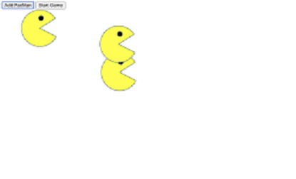

# Pacmen
The Pacmen Factory exercise helped students to practice using arrays, looping and appendChild, and manipulating the DOM. 

To use this repo:

1) First "Fork" the repo to your own in github
2) Go to it in your own repo and choose the green "Code" button and from the pull-down menu choose to "Clone" using your SSH key and copy the URL
4) Go to your local Git (I use Gitbash from Windows Terminal) and type "git clone " and then paste the URL
5) Go to your IDE (I use Visual Studio) and open the folder where you saved it
6) Open a blank tab on your Internet browser (about:blank) and drag the PacMen.html file to it
7) Click "Start Game" and then "Add Pacman".  Each time "Add Pacman" is clicked another Pacman is added, which bounces around the screen.
